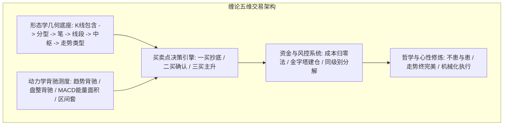

# 缠论完整交易系统架构与实战总纲

> **关联原文**：[[../../raw/072-教你炒股票72_本ID已有课程的再梳理.md|教你炒股票72课]]、[[../../raw/084-教你炒股票84_本ID理论一些必须注意的问题.md|教你炒股票84课]]

## 概述

缠论是一个高度严谨、自洽、互为验证的闭环工程系统。全套体系由**形态学**、**动力学**、**递归论**、**资金管理**与**心性哲学**五大支柱共同筑成。

## 五维系统要素

| 模块 | 核心研究对象 | 关键结论与产出 |
|---|---|---|
| **形态学** | K线包含、分型、笔、线段、中枢 | 确立走势结构骨架与客观引力区间 |
| **动力学** | 趋势背驰、盘整背驰、MACD、区间套 | 测量能量衰竭极值，锁定转折窗口 |
| **决策引擎** | 第一、二、三类买卖点 | 提供唯一、完备的进出场交易指令 |
| **资金管理** | 仓位比例、成本归零、风险止损 | 保障资金安全与长久复利增长 |
| **心性哲学** | 走势终完美、节奏、远离贪嗔痴 | 确保执行力不受生物情绪干扰 |

## 关联概念总览
- 形态学：[[k-line-inclusion|K线包含]]、[[fractal-patterns|顶底分型]]、[[stroke-definition|笔]]、[[line-segment|线段]]、[[trend-pivot|走势中枢]]、[[pivot-evolution|中枢演化]]、[[trend-types|走势类型]]
- 动力学：[[trend-divergence|趋势背驰]]、[[consolidation-divergence|盘整背驰]]、[[macd-auxiliary-judgment|MACD辅助]]、[[nested-interval-locating|区间套]]、[[small-scale-reversal|小转大]]
- 系统与心法：[[three-classes-of-buy-sell-points|三类买卖点]]、[[same-scale-decomposition|同级别分解]]、[[intermediate-yin-phase|中阴阶段]]、[[capital-and-position-management|资金管理]]、[[mechanical-trading-and-rhythm|机械操作]]、[[market-philosophy-invariant|缠论哲学]]
