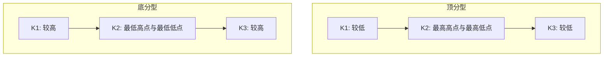

# 顶分型与底分型结构

> **关联原文**：[[../../raw/062-教你炒股票62_分型_笔与线段.md|教你炒股票62课]]、[[../../raw/079-教你炒股票79_分型的辅助操作与一些问题的再解答.md|教你炒股票79课]]、[[../../raw/082-教你炒股票82_分型结构的心理因素.md|教你炒股票82课]]

## 概述

经过包含关系处理后的K线序列中，三根相邻K线构成的极值形态称为**分型**。分型是所有走势转折的微观几何胚胎，分为**顶分型**和**底分型**。

## 顶分型 (Top Fractal)
- **定义**：三根相邻K线中，中间K线（第2根）的最高点为三者最高，且其最低点亦为三者最高。
- **力学本质**：上升行情中多头力量遭遇空头强力反击，冲高受阻并形成回落，代表向上动能的阶段性衰竭。
- **关键信号**：顶分型第3根K线跌破第2根K线的最低点，分型确立；若第3根形成大阴线跌破第1根低点，形成强力顶分型。

## 底分型 (Bottom Fractal)
- **定义**：三根相邻K线中，中间K线（第2根）的最低点为三者最低，且其最高点亦为三者最低。
- **力学本质**：下跌行情中空头宣泄完毕，多头入场承接反弹，代表向下动能的阶段性枯竭。
- **关键信号**：底分型第3根K线收盘站上第2根K线的最高点，分型确立；若伴随放量中大阳线，属于强力底分型。

## 分型的强弱研判
1. **强分型**：第3根K线实体完全包容第2根K线或伴随跳空缺口，反转概率极高。
2. **弱分型**：第3根K线仅产生微弱重叠，且多次出现震荡无力，常演变为中继分型。
3. **中继分型与转折分型**：并非所有分型都会演化为笔的起点或终点，必须结合次级别走势与背驰判断其是否为有效转折。

## 关联概念
- [[k-line-inclusion|K线包含关系与标准化预处理]]
- [[stroke-definition|笔的定义与划分规则]]
- [[three-classes-of-buy-sell-points|三类买卖点完备性定理]]
