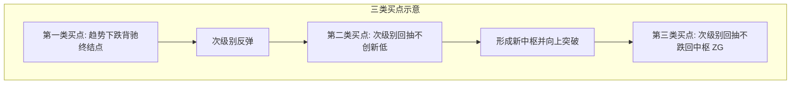

# 三类买卖点完备性定理与分类

> **关联原文**：[[../../raw/014-教你炒股票14_喝茅台的高潮程序_.md|教你炒股票14课]]、[[../../raw/020-教你炒股票20_缠中说禅走势中枢级别扩张及第三类买卖点.md|教你炒股票20课]]、[[../../raw/021-教你炒股票21_缠中说禅买卖点分析的完备性.md|教你炒股票21课]]、[[../../raw/053-教你炒股票53_三类买卖点的再分辨.md|教你炒股票53课]]

## 概述

缠论证明了在任何级别的走势中，**合法的买卖点只有且仅有三类**。所有市场赢利机会均源自这三类买卖点的机械化执行。

## 三类买点的严格定义

### 1. 第一类买点 (1B / 1st Buy Point)
- **定义**：某级别下跌趋势中，最后一个走势中枢形成后，离开段发生**趋势背驰**所构成的转折极值点。
- **特征**：真正的历史大底与趋势转折点。风险最低、潜在收益最大。

### 2. 第二类买点 (2B / 2nd Buy Point)
- **定义**：第一类买点出现后，次级别反弹并展开次级别回调，该**回调低点不破第一类买点的最低点**所构成的转折点。
- **特征**：右侧确认点。特别适合稳健型大资金进场。

### 3. 第三类买点 (3B / 3rd Buy Point)
- **定义**：一个次级别走势类型向上离开走势中枢后，其次级别走势类型回抽，其**低点不触及原走势中枢区间的高点 $ZG$**（即 $low > ZG$）。
- **特征**：中枢破坏点，主升浪暴拉前夕。上涨速度最快、资金效率最高。

## 三类卖点 (1S, 2S, 3S)
- 对应于三类买点的反向形态：
  - **第一类卖点 (1S)**：上涨趋势背驰点；
  - **第二类卖点 (2S)**：次级别反弹不破前高点；
  - **第三类卖点 (3S)**：跌破中枢后次级别回抽不触及中枢低点 $ZD$。

## 买卖点完备性定理
> **定理**：市场上所有盈利性的买卖行为，最终都可以完全分解归入这三类买卖点中，绝无例外。

## 关联概念
- [[trend-divergence|趋势背驰与标准背驰判定]]
- [[trend-pivot|走势中枢的数学定义与区间确定]]
- [[nested-interval-locating|区间套定位定理与精确买卖点打击]]
