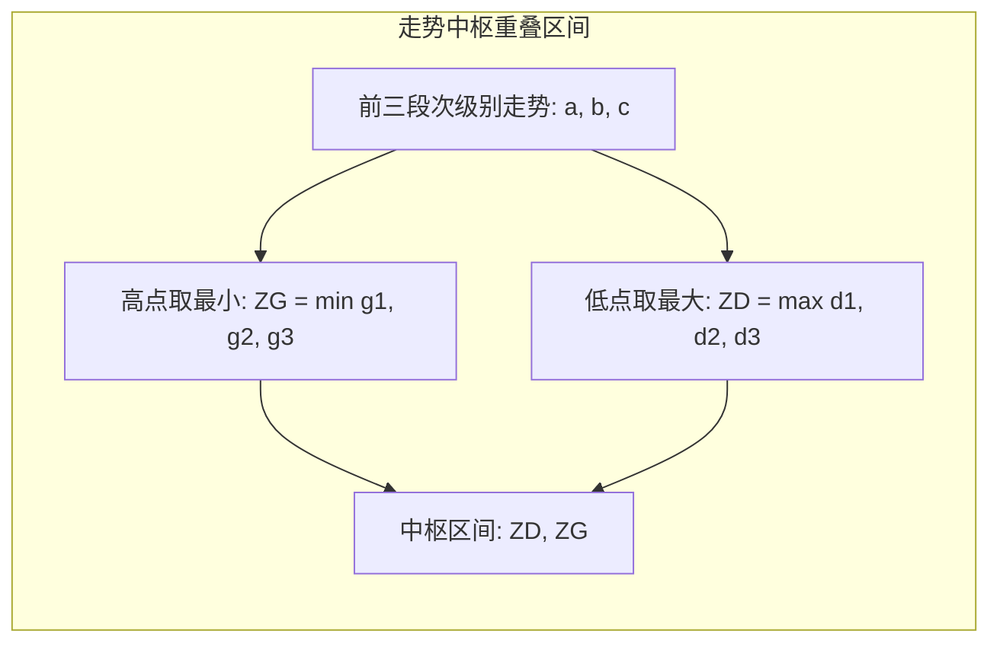

# 走势中枢的数学定义与区间确定

> **关联原文**：[[../../raw/017-教你炒股票17_走势终完美.md|教你炒股票17课]]、[[../../raw/020-教你炒股票20_缠中说禅走势中枢级别扩张及第三类买卖点.md|教你炒股票20课]]、[[../../raw/035-教你炒股票35_给基础差的同学补补课.md|教你炒股票35课]]

## 概述

**走势中枢**（简称中枢）是缠论技术分析体系最核心的几何基石。它不仅是价格波动的物理重叠区，更是多空双方资金力量反复角逐形成的**价值中枢引力场**。

## 中枢的严格数学定义

某级别走势类型中，**被至少三个连续次级别走势类型所重叠的部分**，称为该级别的走势中枢。

设连续三个次级别走势分别为 $S_1, S_2, S_3$：
- 各段的高点分别为 $g_1, g_2, g_3$，低点分别为 $d_1, d_2, d_3$；
- **中枢高点 ZG (Zhongshu High)**：$ZG = \min(g_1, g_2, g_3)$（三段高点中的最小值）；
- **中枢低点 ZD (Zhongshu Low)**：$ZD = \max(d_1, d_2, d_3)$（三段低点中的最大值）；
- **中枢波动高点 GG**：$GG = \max(g_1, g_2, g_3)$；
- **中枢波动低点 DD**：$DD = \min(d_1, d_2, d_3)$。

**中枢成立的充要条件**：
$$ZG > ZD$$
若 $\min(g_1, g_2, g_3) \le \max(d_1, d_2, d_3)$，则三段之间无重叠区间，不能构成中枢。

## 中枢的进入段与离开段
- 进入中枢的第一段走势称为 **进入段 $a$**；
- 围绕中枢震荡形成重叠的三段走势为 $S_1, S_2, S_3$（中枢主体 $A$）；
- 最终脱离中枢的走势称为 **离开段 $b$**；
- 完整的走势中枢结构表示为：$a + A + b$。

## 关联概念
- [[pivot-evolution|走势中枢的延续、扩展与扩张]]
- [[trend-types|走势类型：上涨、下跌与盘整]]
- [[trend-completeness|走势终完美核心定理]]
- [[three-classes-of-buy-sell-points|三类买卖点完备性定理]]
