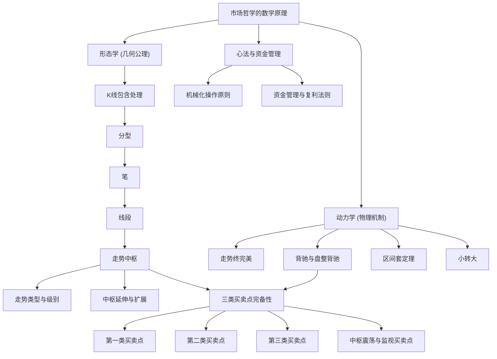

# 缠论《教你炒股票108课》知识图谱总纲 (Chanlun 108 Wiki Index)

> 欢迎查阅缠论 108 课 LLM Wiki 知识图谱。本知识库采用**冷热物理隔离架构**，热层 `onewiki/` 提炼核心公理、实体与逐课精要，冷层 `raw/` 保持历史原文。

---

## 🗺️ 五维知识体系全景

### 1. 几何形态学 (Morphology)
- [[K线包含处理]]：方向结合律、高低极值合并、消除重叠
- [[分型]]：顶分型、底分型、分型强弱判定
- [[笔]]：顶底独立、新笔定义、空间断层与5根独立K线
- [[线段]]：三笔重叠、特征序列、线段破坏的两种情况（无缺口/有缺口）
- [[走势中枢]]：次级别走势重叠、[ZD, ZG]、GG/DD
- [[走势类型与级别]]：盘整与趋势完备分类、显微镜递归机制
- [[中枢延伸与扩展]]：6段与9段升级、中枢扩张、中枢扩展

### 2. 动力学与物理机制 (Dynamics)
- [[走势终完美]]：第一公理、结构完备性、不测而测
- [[背驰与盘整背驰]]：趋势背驰、力度衰竭、离开段与进入段比较
- [[区间套定理]]：跨级别显微镜放大、秒级极值锁定
- [[小转大]]：次级别剧烈背驰引发大级别反转、二买确认

### 3. 买卖点体系 (Buy/Sell Points)
- [[第一类买卖点]]：趋势背驰转折奇点（1B / 1S）
- [[第二类买卖点]]：次级别回抽不创新低/新高的安全确认点（2B / 2S）
- [[第三类买卖点]]：次级别离开回抽不破中枢上轨ZG的起爆点（3B / 3S）
- [[中枢震荡与监视买卖点]]：围绕中枢上下轨高抛低吸、负成本套利法

### 4. 关键实体与辅助工具 (Entities & Tools)
- [[缠中说禅]]：学派创始人、博客历史与思想全景
- [[MACD指标]]：背驰辅助判定显微镜、黄白线回抽零轴、红绿柱面积比较
- [[均线系统]]：飞吻、唇吻、湿吻、女上位与男上位法则

### 5. 市场哲学与资金管理 (Philosophy & Money Management)
- [[市场哲学的数学原理]]：唯物主义交易论、自相似自组织、闻见学行
- [[机械化操作原则]]：见买点买、见卖点卖、克服贪婪恐惧
- [[资金管理与复利法则]]：零成本持仓策略、仓位配置、复利无限游戏

---

## 📚 108 课精编逐课索引 (Summaries)

### 📌 第一阶段：初入股海与均线缠绕 (第 1 课 ~ 第 20 课)

- [[summary-lesson-001|第1课：教你炒股票1：不会赢钱的经济人，只是废人！]]：资本市场本质是赢家与输家的博弈，不赢钱的所谓经济人只是废人。交易不是为了情怀，而是为了掠夺赢利。
- [[summary-lesson-002|第2课：教你炒股票2：没有庄家，有的只是赢家和输家！]]：破除散户对庄家的迷信。市场中没有不可战胜的庄家，庄家只是资金体量更大的投机者，往往更容易被市场流动性消灭。
- [[summary-lesson-003|第3课：教你炒股票3：你的喜好，你的死亡陷阱！]]：投资中最大的死亡陷阱就是你的喜好。喜欢某只股票、对某家公司产生感情，是投资者走向破灭的最快路径。
- [[summary-lesson-004|第4课：教你炒股票4：什么是理性？今早买N中工就是理性！]]：理性不是教科书上的书呆子教条，在市场疯狂的当下，看清合力并敢于在风口出击就是最大的理性。
- [[summary-lesson-005|第5课：教你炒股票5：市场无须分析，只要看和干！]]：市场无需事后诸葛亮式的分析，只要看和干。在买点看明白就干，在卖点看明白就撤。
- [[summary-lesson-006|第6课：教你炒股票6：本ID如何在五粮液、包钢权证上提款的！]]：通过五粮液认购权证和包钢权证实战，解构 T+0 权证的提款机逻辑与差价套利机制。
- [[summary-lesson-007|第7课：教你炒股票7：给赚了指数亏了钱的一些忠告]]：给赚了指数亏了钱投资者的忠告：节奏是股票交易的生命，踏错节奏牛市也会倾家荡产。
- [[summary-lesson-008|第8课：教你炒股票8：投资如选面首，G点为中心，拒绝ED男！]]：以选面首为生动比喻，确立只寻找处于上升通道、具备强烈爆发力（G点）的品种，坚决抛弃疲软无力的ED男股票。
- [[summary-lesson-009|第9课：教你炒股票9：甄别“早泄”男的数学原则！]]：甄别早泄男的数学原则：利用短期均线与背离信号，精准识别假突破与冲高乏力走势。
- [[summary-lesson-010|第10课：教你炒股票10：2005年6月，本ID为何时隔四年后重看股票]]：禅师复盘 2005 年 6 月 998 历史性大底建仓心路，阐释长期周期拐点与国运大牛市逻辑。
- [[summary-lesson-011|第11课：教你炒股票11：不会吻，无以高潮！]]：均线系统的缠中说禅定义：飞吻、唇吻与湿吻，女上位与男上位的多空基准法则。
- [[summary-lesson-012|第12课：教你炒股票12：一吻何能消魂？]]：深度剖析一吻何能消魂：湿吻之后的分化，真假突破与多头第一二买点的均线确认形态。
- [[summary-lesson-013|第13课：教你炒股票13：不带套的操作不是好操作！]]：不带套的操作不是好操作：引入安全带法则，建立短线防狼术与止损/止盈风控程序。
- [[summary-lesson-014|第14课：教你炒股票14：喝茅台的高潮程序！]]：喝茅台的高潮程序：以贵州茅台为例，演示如何通过大级别趋势持股配合次级别差价实现利润最大化。
- [[summary-lesson-015|第15课：教你炒股票15：没有趋势，没有背驰。]]：没有趋势，没有背驰。正式确立缠论动力学的核心前提：背驰必须基于趋势中枢的比较。
- [[summary-lesson-016|第16课：教你炒股票16：中小资金的高效买卖法。]]：中小资金的高效买卖法：中小资金绝不打消耗战，必须在趋势爆发的最敏感买点切入，实现高资金利用率。
- [[summary-lesson-017|第17课：教你炒股票17：走势终完美]]：走势终完美公理的确立：任何级别的任何走势类型终要完成，这是缠论的几何最高纲领。
- [[summary-lesson-018|第18课：教你炒股票18：不被面首的雏男是不完美的。]]：不被面首的雏男是不完美的：市场如试金石，任何新手必须经过中枢震荡与买卖点的千锤百炼才能成熟。
- [[summary-lesson-019|第19课：教你炒股票19：学习缠中说禅技术分析理论的关键]]：学习缠中说禅技术分析理论的关键：彻底破除先验假设，以当下走势为唯一现实。
- [[summary-lesson-020|第20课：教你炒股票20：缠中说禅走势中枢级别扩张及第三类买卖点]]：缠中说禅走势中枢级别扩张及第三类买卖点：中枢的演化法则与主升浪风口的确立。

### 📌 第二阶段：中枢确立与动力学背驰 (第 21 课 ~ 第 40 课)

- [[summary-lesson-021|第21课：教你炒股票21：缠中说禅买卖点分析的完备性]]：缠中说禅买卖点分析的完备性：证明市场一切转折点完备地归属于三类买卖点，无一漏网。
- [[summary-lesson-022|第22课：教你炒股票22：将8亿的大米装到5个庄家的肚里。]]：走势中枢的严格定义、走势类型完备分类、背驰判定与买卖点完备性
- [[summary-lesson-023|第23课：教你炒股票23：市场与人生]]：走势中枢的严格定义、走势类型完备分类、背驰判定与买卖点完备性
- [[summary-lesson-024|第24课：教你炒股票24：MACD对背弛的辅助判断]]：MACD对背弛的辅助判断：黄白线与红绿柱面积在衡量走势动能衰竭中的严密用法。
- [[summary-lesson-025|第25课：教你炒股票25：吻，MACD、背弛、中枢]]：吻、MACD、背弛、中枢大综合：将前期均线系统、几何中枢与动力学指标熔铸为一体化决策体系。
- [[summary-lesson-026|第26课：教你炒股票26：市场风险如何回避]]：走势中枢的严格定义、走势类型完备分类、背驰判定与买卖点完备性
- [[summary-lesson-027|第27课：教你炒股票27： 盘整背驰与历史性底部]]：盘整背驰与历史性底部：如何在没有两个中枢的情况下，利用盘整背驰捕捉历史大底部。
- [[summary-lesson-028|第28课：教你炒股票28：下一目标：摧毁基金]]：走势中枢的严格定义、走势类型完备分类、背驰判定与买卖点完备性
- [[summary-lesson-029|第29课：教你炒股票29：转折的力度与级别]]：转折的力度与级别：阐述背驰后走势反转的三种必然路径及跨级别能量传导。
- [[summary-lesson-030|第30课：教你炒股票30：缠中说禅理论的绝对性]]：走势中枢的严格定义、走势类型完备分类、背驰判定与买卖点完备性
- [[summary-lesson-031|第31课：教你炒股票31：资金管理的最稳固基础]]：形态学底层公理体系：包含关系、顶底分型、笔的构筑与线段重叠
- [[summary-lesson-032|第32课：教你炒股票32：走势的当下与投资者的思维方式]]：形态学底层公理体系：包含关系、顶底分型、笔的构筑与线段重叠
- [[summary-lesson-033|第33课：教你炒股票33：走势的多义性]]：走势类型分解定理与走势的多义性：结合律的数学运用，消除对中枢划分的刻板执念。
- [[summary-lesson-034|第34课：教你炒股票34：宁当面首，莫成怨男]]：形态学底层公理体系：包含关系、顶底分型、笔的构筑与线段重叠
- [[summary-lesson-035|第35课：教你炒股票35：给基础差的同学补补课]]：形态学底层公理体系：包含关系、顶底分型、笔的构筑与线段重叠
- [[summary-lesson-036|第36课：教你炒股票36：走势类型连接结合性的简单运用]]：形态学底层公理体系：包含关系、顶底分型、笔的构筑与线段重叠
- [[summary-lesson-037|第37课：教你炒股票37：背驰的再分辨]]：形态学底层公理体系：包含关系、顶底分型、笔的构筑与线段重叠
- [[summary-lesson-038|第38课：教你炒股票38：走势类型连接的同级别分解]]：形态学底层公理体系：包含关系、顶底分型、笔的构筑与线段重叠
- [[summary-lesson-039|第39课：教你炒股票39：同级别分解再研究]]：中枢震荡监视器与力学分析：围绕中枢上下轨构建高抛低吸的高精度套利程序。
- [[summary-lesson-040|第40课：教你炒股票40：同级别分解的多重赋格]]：形态学底层公理体系：包含关系、顶底分型、笔的构筑与线段重叠

### 📌 第三阶段：形态学底层公理体系重构 (第 41 课 ~ 第 60 课)

- [[summary-lesson-041|第41课：教你炒股票41：没有节奏，只有死]]：形态学底层公理体系：包含关系、顶底分型、笔的构筑与线段重叠
- [[summary-lesson-042|第42课：教你炒股票42：有些人是不适合参与市场的]]：形态学底层公理体系：包含关系、顶底分型、笔的构筑与线段重叠
- [[summary-lesson-043|第43课：教你炒股票43：有关背驰的补习课]]：没有节奏只有死：警告投机者若不能掌握买卖点节奏，将在震荡与单边市中被反复绞杀。
- [[summary-lesson-044|第44课：教你炒股票44：小级别背驰引发大级别转折]]：形态学底层公理体系：包含关系、顶底分型、笔的构筑与线段重叠
- [[summary-lesson-045|第45课：教你炒股票45：持股与持币，两种最基本的操作。]]：形态学底层公理体系：包含关系、顶底分型、笔的构筑与线段重叠
- [[summary-lesson-046|第46课：教你炒股票46：每日走势的分类]]：形态学底层公理体系：包含关系、顶底分型、笔的构筑与线段重叠
- [[summary-lesson-047|第47课：教你炒股票47：一夜情行情分析]]：形态学底层公理体系：包含关系、顶底分型、笔的构筑与线段重叠
- [[summary-lesson-048|第48课：教你炒股票48：暴跌，牛市行情的一夜情]]：形态学底层公理体系：包含关系、顶底分型、笔的构筑与线段重叠
- [[summary-lesson-049|第49课：教你炒股票49：利润率最大的操作模式]]：形态学底层公理体系：包含关系、顶底分型、笔的构筑与线段重叠
- [[summary-lesson-050|第50课：教你炒股票50：操作中的一些细节问题]]：形态学底层公理体系：包含关系、顶底分型、笔的构筑与线段重叠
- [[summary-lesson-051|第51课：教你炒股票51：短线股评荐股者的传销把戏]]：形态学底层公理体系：包含关系、顶底分型、笔的构筑与线段重叠
- [[summary-lesson-052|第52课：教你炒股票52：炒股票就是真正的学佛]]：形态学底层公理体系：包含关系、顶底分型、笔的构筑与线段重叠
- [[summary-lesson-053|第53课：教你炒股票53：三类买卖点的再分辨]]：形态学底层公理体系：包含关系、顶底分型、笔的构筑与线段重叠
- [[summary-lesson-054|第54课：教你炒股票54：一个具体走势的分析]]：形态学底层公理体系：包含关系、顶底分型、笔的构筑与线段重叠
- [[summary-lesson-055|第55课：教你炒股票55：买之前戏，卖之高潮]]：形态学底层公理体系：包含关系、顶底分型、笔的构筑与线段重叠
- [[summary-lesson-056|第56课：教你炒股票56：530印花税当日行情图解]]：形态学底层公理体系：包含关系、顶底分型、笔的构筑与线段重叠
- [[summary-lesson-057|第57课：教你炒股票57：当下图解分析再示范]]：形态学底层公理体系：包含关系、顶底分型、笔的构筑与线段重叠
- [[summary-lesson-058|第58课：教你炒股票58：图解分析示范三]]：形态学底层公理体系：包含关系、顶底分型、笔的构筑与线段重叠
- [[summary-lesson-059|第59课：教你炒股票59：图解分析示范四]]：形态学底层公理体系：包含关系、顶底分型、笔的构筑与线段重叠
- [[summary-lesson-060|第60课：教你炒股票60：图解分析示范五]]：形态学底层公理体系：包含关系、顶底分型、笔的构筑与线段重叠

### 📌 第四阶段：特征序列、线段破坏与区间套 (第 61 课 ~ 第 80 课)

- [[summary-lesson-061|第61课：教你炒股票61：区间套定位标准图解（分析示范六）]]：区间套定理定位买卖点：高倍显微镜跨级别联立分析法，将大级别买点精确收拢到分秒之间。
- [[summary-lesson-062|第62课：教你炒股票62：分型、笔与线段]]：特征序列分型、线段破坏的两种情况、新笔修正与区间套极值定位
- [[summary-lesson-063|第63课：教你炒股票63：替各位理理基本概念]]：特征序列分型、线段破坏的两种情况、新笔修正与区间套极值定位
- [[summary-lesson-064|第64课：教你炒股票64：去机场路上给各位补课]]：特征序列分型、线段破坏的两种情况、新笔修正与区间套极值定位
- [[summary-lesson-065|第65课：教你炒股票65：再说说分型、笔、线段]]：线段划分定理与特征序列：通过特征序列的顶底分型，解决线段划分的客观唯一性。
- [[summary-lesson-066|第66课：教你炒股票66：主力资金的食物链]]：特征序列分型、线段破坏的两种情况、新笔修正与区间套极值定位
- [[summary-lesson-067|第67课：教你炒股票67：线段的划分标准]]：线段划分定理之第一种情况与第二种情况：有缺口与无缺口特征序列分型的破坏判定准则。
- [[summary-lesson-068|第68课：教你炒股票68：走势预测的精确意义]]：特征序列分型、线段破坏的两种情况、新笔修正与区间套极值定位
- [[summary-lesson-069|第69课：教你炒股票69：月线分段与上海大走势分析、预判]]：特征序列分型、线段破坏的两种情况、新笔修正与区间套极值定位
- [[summary-lesson-070|第70课：教你炒股票70：一个教科书式走势的示范分析]]：特征序列分型、线段破坏的两种情况、新笔修正与区间套极值定位
- [[summary-lesson-071|第71课：教你炒股票71：线段划分标准的再分辨]]：特征序列分型、线段破坏的两种情况、新笔修正与区间套极值定位
- [[summary-lesson-072|第72课：教你炒股票72：本ID已有课程的再梳理]]：特征序列分型、线段破坏的两种情况、新笔修正与区间套极值定位
- [[summary-lesson-073|第73课：教你炒股票73：市场获利机会的绝对分类]]：特征序列分型、线段破坏的两种情况、新笔修正与区间套极值定位
- [[summary-lesson-074|第74课：教你炒股票74：如何躲避政策性风险]]：特征序列分型、线段破坏的两种情况、新笔修正与区间套极值定位
- [[summary-lesson-075|第75课：教你炒股票75：逗庄家玩的一些杂史1]]：特征序列分型、线段破坏的两种情况、新笔修正与区间套极值定位
- [[summary-lesson-076|第76课：教你炒股票76：逗庄家玩的一些杂史2]]：特征序列分型、线段破坏的两种情况、新笔修正与区间套极值定位
- [[summary-lesson-077|第77课：教你炒股票77：一些概念的再分辨]]：笔定义的新修正与严格标准：顶分型与底分型之间必须满足纯粹空间断层，顶底不能重叠。
- [[summary-lesson-078|第78课：教你炒股票78：继续说线段的划分]]：特征序列分型、线段破坏的两种情况、新笔修正与区间套极值定位
- [[summary-lesson-079|第79课：教你炒股票79：分型的辅助操作与一些问题的再解答]]：特征序列分型、线段破坏的两种情况、新笔修正与区间套极值定位
- [[summary-lesson-080|第80课：教你炒股票80：市场没有同情、不信眼泪]]：特征序列分型、线段破坏的两种情况、新笔修正与区间套极值定位

### 📌 第五阶段：多义性结合律与操作实战 (第 81 课 ~ 第 100 课)

- [[summary-lesson-081|第81课：教你炒股票81：图例、更正及分型、走势类型的哲学本质]]：走势多义性与结合律、中枢震荡套利、小转大应对与操作级别选择
- [[summary-lesson-082|第82课：教你炒股票82：分型结构的心理因素]]：走势多义性与结合律、中枢震荡套利、小转大应对与操作级别选择
- [[summary-lesson-083|第83课：教你炒股票83：笔-线段与线段-最小中枢结构的不同心理意义1]]：走势多义性与结合律、中枢震荡套利、小转大应对与操作级别选择
- [[summary-lesson-084|第84课：教你炒股票84：本ID理论一些必须注意的问题]]：本ID理论的哲学逻辑闭环：从分型、笔、线段递归到中枢与走势类型的整体大图景。
- [[summary-lesson-085|第85课：教你炒股票85：逗庄家玩的一些杂史3]]：走势多义性与结合律、中枢震荡套利、小转大应对与操作级别选择
- [[summary-lesson-086|第86课：教你炒股票86：走势分析中必须杜绝一根筋思维]]：走势多义性与结合律、中枢震荡套利、小转大应对与操作级别选择
- [[summary-lesson-087|第87课：教你炒股票87：逗庄家玩的一些杂史4]]：走势多义性与结合律、中枢震荡套利、小转大应对与操作级别选择
- [[summary-lesson-088|第88课：教你炒股票88：图形生长的一个具体案例]]：走势多义性与结合律、中枢震荡套利、小转大应对与操作级别选择
- [[summary-lesson-089|第89课：教你炒股票89：中阴阶段的具体分析]]：走势多义性与结合律、中枢震荡套利、小转大应对与操作级别选择
- [[summary-lesson-090|第90课：教你炒股票90：中阴阶段结束时间的辅助判断]]：走势多义性与结合律、中枢震荡套利、小转大应对与操作级别选择
- [[summary-lesson-091|第91课：教你炒股票91：走势结构的两重表里关系1]]：走势多义性与结合律、中枢震荡套利、小转大应对与操作级别选择
- [[summary-lesson-092|第92课：教你炒股票92：中枢震荡的监视器]]：走势多义性与结合律、中枢震荡套利、小转大应对与操作级别选择
- [[summary-lesson-093|第93课：教你炒股票93：走势结构的两重表里关系2]]：走势多义性与结合律、中枢震荡套利、小转大应对与操作级别选择
- [[summary-lesson-094|第94课：教你炒股票94：当机立断]]：走势多义性与结合律、中枢震荡套利、小转大应对与操作级别选择
- [[summary-lesson-095|第95课：教你炒股票95：修炼自己]]：走势多义性与结合律、中枢震荡套利、小转大应对与操作级别选择
- [[summary-lesson-096|第96课：教你炒股票96：无处不在的赌徒心理]]：走势多义性与结合律、中枢震荡套利、小转大应对与操作级别选择
- [[summary-lesson-097|第97课：教你炒股票97：中医、兵法、诗歌、操作1]]：走势多义性与结合律、中枢震荡套利、小转大应对与操作级别选择
- [[summary-lesson-098|第98课：教你炒股票98：中医、兵法、诗歌、操作2]]：走势多义性与结合律、中枢震荡套利、小转大应对与操作级别选择
- [[summary-lesson-099|第99课：教你炒股票99：走势结构的两重表里关系3]]：走势多义性与结合律、中枢震荡套利、小转大应对与操作级别选择
- [[summary-lesson-100|第100课：教你炒股票100：中医、兵法、诗歌、操作3]]：走势多义性与结合律、中枢震荡套利、小转大应对与操作级别选择

### 📌 第六阶段：宏观推演、底部确立与哲学终章 (第 101 课 ~ 第 108 课)

- [[summary-lesson-101|第101课：教你炒股票101：答疑1]]：实战看盘要领、大周期月线走势演化、底部形态确立与交易哲学解脱
- [[summary-lesson-102|第102课：教你炒股票102：再说走势必完美]]：实战看盘要领、大周期月线走势演化、底部形态确立与交易哲学解脱
- [[summary-lesson-103|第103课：教你炒股票103：学屠龙术前先学好防狼术]]：实战看盘要领、大周期月线走势演化、底部形态确立与交易哲学解脱
- [[summary-lesson-104|第104课：教你炒股票104：几何结构与能量动力结构1]]：实战看盘要领、大周期月线走势演化、底部形态确立与交易哲学解脱
- [[summary-lesson-105|第105课：教你炒股票105：远离聪明、机械操作]]：实战看盘要领、大周期月线走势演化、底部形态确立与交易哲学解脱
- [[summary-lesson-106|第106课：教你炒股票106：均线、轮动与缠中说禅板块强弱指标]]：实战看盘要领、大周期月线走势演化、底部形态确立与交易哲学解脱
- [[summary-lesson-107|第107课：教你炒股票107：如何操作短线反弹]]：实战看盘要领、大周期月线走势演化、底部形态确立与交易哲学解脱
- [[summary-lesson-108|第108课：教你炒股票108：何谓底部？从月线看中期走势演化]]：何谓底部：从月线看中期走势演化。108课收官之作，站在最高时空维度揭示大周期牛熊更迭与人生境界。

### 📌 附录文章精选

- [[summary-附录-CPI公布成突破契机|CPI公布成突破契机]]
- [[summary-附录-偶见湘火炬广告牌_口占五绝|偶见湘火炬广告牌，口占五绝。]]
- [[summary-附录-无论多空_都必须要进的一步|无论多空，都必须要进的一步。]]
- [[summary-附录-神州自有中天日_万国衣冠舞九韶|神州自有中天日，万国衣冠舞九韶]]
- [[summary-附录-请远离所有借股票收费者|请远离所有借股票收费者！]]

