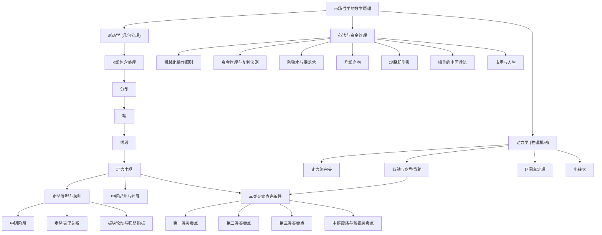

# 缠论《教你炒股票108课》知识图谱总纲 (Chanlun 108 Wiki Index)

> 欢迎查阅缠论 108 课 LLM Wiki 知识图谱。本知识库采用**冷热物理隔离架构**，热层 `onewiki/` 提炼核心公理、实体与逐课精要，冷层 `raw/` 保持历史原文。

---

## 五维知识体系全景

### 1. 几何形态学 (Morphology)
- [[K线包含处理]]：方向结合律、高低极值合并、消除重叠
- [[分型]]：顶分型、底分型、分型强弱判定
- [[笔]]：顶底独立、新笔定义、空间断层与5根独立K线
- [[线段]]：三笔重叠、特征序列、线段破坏的两种情况（无缺口/有缺口）
- [[走势中枢]]：次级别走势重叠、[ZD, ZG]、GG/DD
- [[走势类型与级别]]：盘整与趋势完备分类、显微镜递归机制
- [[中枢延伸与扩展]]：6段与9段升级、中枢扩张、中枢扩展
- [[中阴阶段]]：背驰后新走势未定的过渡，必先形成高一级别中枢
- [[走势表里关系]]：笔定理四状态、跨周期矩阵与治未病

### 2. 动力学与物理机制 (Dynamics)
- [[走势终完美]]：第一公理、结构完备性、不测而测
- [[背驰与盘整背驰]]：趋势背驰、力度衰竭、离开段与进入段比较
- [[区间套定理]]：跨级别显微镜放大、秒级极值锁定
- [[小转大]]：次级别剧烈背驰引发大级别反转、二买确认

### 3. 买卖点体系 (Buy/Sell Points)
- [[第一类买卖点]]：趋势背驰转折奇点（1B / 1S）
- [[第二类买卖点]]：次级别回抽不创新低/新高的安全确认点（2B / 2S）
- [[第三类买卖点]]：次级别离开回抽不破中枢上轨ZG的起爆点（3B / 3S）
- [[中枢震荡与监视买卖点]]：围绕中枢上下轨高抛低吸、负成本套利法

### 4. 关键实体与辅助工具 (Entities & Tools)
- [[缠中说禅]]：学派创始人、博客历史与思想全景
- [[MACD指标]]：背驰辅助判定显微镜、黄白线回抽零轴、红绿柱面积比较
- [[均线系统]]：短中长期均线构成的强弱评价系统
- [[均线之吻]]：飞吻、唇吻、湿吻，女上位与男上位法则
- [[板块轮动与强弱指标]]：九类分类与缠中说禅板块强弱指标

### 5. 市场哲学与资金管理 (Philosophy & Money Management)
- [[市场哲学的数学原理]]：唯物主义交易论、自相似自组织、闻见学行
- [[机械化操作原则]]：见买点买、见卖点卖、克服贪婪恐惧
- [[资金管理与复利法则]]：零成本持仓策略、仓位配置、复利无限游戏
- [[防狼术与屠龙术]]：先自保（MACD 0轴）后猎杀
- [[炒股即学佛]]：于贪嗔痴大烦恼中得大自在、零向量修行
- [[操作的中医兵法]]：治未病、表里辨证、知己知彼、避实击虚
- [[市场与人生]]：技艺之上是修养人格见识

---

## 108 课精编逐课索引 (Summaries)

### 第一阶段：初入股海与均线缠绕（第1–20课）

- [[summary-lesson-001|第1课：教你炒股票1：不会赢钱的经济人，只是废人！]]：资本市场本质是赢家与输家的博弈，不赢钱的所谓经济人只是废人。交易不是为了情怀，而是为了掠夺赢利。
- [[summary-lesson-002|第2课：教你炒股票2：没有庄家，有的只是赢家和输家！]]：破除散户对庄家的迷信。市场中没有不可战胜的庄家，庄家只是资金体量更大的投机者，往往更容易被市场流动性消灭。
- [[summary-lesson-003|第3课：教你炒股票3：你的喜好，你的死亡陷阱！]]：投资中最大的死亡陷阱就是你的喜好。喜欢某只股票、对某家公司产生感情，是投资者走向破灭的最快路径。
- [[summary-lesson-004|第4课：教你炒股票4：什么是理性？今早买N中工就是理性！]]：理性不是教科书上的书呆子教条，在市场疯狂的当下，看清合力并敢于在风口出击就是最大的理性。
- [[summary-lesson-005|第5课：教你炒股票5：市场无须分析，只要看和干！]]：市场无需事后诸葛亮式的分析，只要看和干。在买点看明白就干，在卖点看明白就撤。
- [[summary-lesson-006|第6课：教你炒股票6：本ID如何在五粮液、包钢权证上提款的！]]：通过五粮液认购权证和包钢权证实战，解构 T+0 权证的提款机逻辑与差价套利机制。
- [[summary-lesson-007|第7课：教你炒股票7：给赚了指数亏了钱的一些忠告]]：节奏是股票交易的生命，踏错节奏牛市也会倾家荡产。
- [[summary-lesson-008|第8课：教你炒股票8：投资如选面首，G点为中心，拒绝ED男！]]：只寻找处于上升通道、具备爆发力（G点）的品种，抛弃疲软无力的 ED 男股票。
- [[summary-lesson-009|第9课：教你炒股票9：甄别“早泄”男的数学原则！]]：利用短期均线与背离信号，精准识别假突破与冲高乏力走势。
- [[summary-lesson-010|第10课：2005年6月，本ID为何时隔四年后重看股票]]：复盘998历史性大底建仓心路，阐释长期周期拐点与国运大牛市逻辑。
- [[summary-lesson-011|第11课：不会吻，无以高潮！]]：均线之吻——飞吻、唇吻、湿吻，女上位与男上位的多空基准。
- [[summary-lesson-012|第12课：一吻何能消魂？]]：湿吻之后的分化，真假突破与多头第一二买点的均线确认。
- [[summary-lesson-013|第13课：不带套的操作不是好操作！]]：引入安全带法则，建立短线防狼术与风控程序。
- [[summary-lesson-014|第14课：喝茅台的高潮程序！]]：以贵州茅台为例，演示大级别趋势持股配合次级别差价实现利润最大化。
- [[summary-lesson-015|第15课：没有趋势，没有背驰。]]：确立动力学核心前提：背驰必须基于趋势中枢的比较。
- [[summary-lesson-016|第16课：中小资金的高效买卖法。]]：中小资金不打消耗战，在趋势爆发最敏感买点切入，实现高资金利用率。
- [[summary-lesson-017|第17课：走势终完美]]：任何级别的任何走势类型终要完成，这是缠论的几何最高纲领。
- [[summary-lesson-018|第18课：不被面首的雏男是不完美的。]]：新手必须经过中枢震荡与买卖点的千锤百炼才能成熟。
- [[summary-lesson-019|第19课：学习缠中说禅技术分析理论的关键]]：彻底破除先验假设，以当下走势为唯一现实。
- [[summary-lesson-020|第20课：走势中枢级别扩张及第三类买卖点]]：中枢演化法则与主升浪风口的确立。

### 第二阶段：中枢确立与动力学背驰（第21–40课）

- [[summary-lesson-021|第21课：买卖点分析的完备性]]：证明市场一切转折点完备地归属于三类买卖点，无一漏网。
- [[summary-lesson-022|第22课：将8亿的大米装到5个庄家的肚里]]：大资金阻击模型：分散潜伏、留机动资金、对症下药；宜在低位大级别三买硬插，资金绝对自由，最忌阻击成庄家。
- [[summary-lesson-023|第23课：市场与人生]]：技术粗浅，纯交易机器以生命耗费换回报；资本是当下命运，自由解脱在五浊恶世最恶浊处修得。
- [[summary-lesson-024|第24课：MACD对背弛的辅助判断]]：黄白线与红绿柱面积在衡量动能衰竭中的严密用法。
- [[summary-lesson-025|第25课：吻，MACD、背弛、中枢]]：把均线系统、几何中枢与动力学指标熔铸为一体化决策体系。
- [[summary-lesson-026|第26课：市场风险如何回避]]：一切风险归于价格波动；理论不能控交易突停与钱有限期；真正无风险是把成本做成负数。
- [[summary-lesson-027|第27课：盘整背驰与历史性底部]]：在没有两个中枢时，利用盘整背驰捕捉历史大底部。
- [[summary-lesson-028|第28课：下一目标：摧毁基金]]：基金是合法传销，命门是钱非自有、赎回随时、受净值与比例束缚，可借其超配与短差无能反复阻击。
- [[summary-lesson-029|第29课：转折的力度与级别]]：阐述背驰后走势反转的三种必然路径及跨级别能量传导。
- [[summary-lesson-030|第30课：缠中说禅理论的绝对性]]：以时间不可逆、价格充分有效、非完全趋同为前提的公理化理论；初步功力是修成零向量。
- [[summary-lesson-031|第31课：资金管理的最稳固基础]]：成本0前全力变0（只跌补不追涨、短差不增股），成本0后挣股票，0成本股种类越多基础越稳。
- [[summary-lesson-032|第32课：走势的当下与投资者的思维方式]]：破除死多死空，多空须有客观条件，大跌找三买；走势当下赋予、无须预测。
- [[summary-lesson-033|第33课：走势的多义性]]：走势分解定理与多义性，结合律的运用，消除对中枢划分的刻板执念。
- [[summary-lesson-034|第34课：宁当面首，莫成怨男]]：失败者皆被情绪操控；以正闻正见正学正行依当下走势而行，反向立即退出。
- [[summary-lesson-035|第35课：给基础差的同学补补课]]：以级别打破循环定义，从每笔交易递归出各级别中枢；连接符合结合律不符合交换律。
- [[summary-lesson-036|第36课：走势类型连接结合性的简单运用]]：多义性是严格理论下的多视角；用于分级、当下判断、重组与识别更早次级别买卖点。
- [[summary-lesson-037|第37课：背驰的再分辨]]：A、B 同级才是趋势；c 必为次级别且创新高低、内部至少两个次级别中枢，可区间套定位。
- [[summary-lesson-038|第38课：走势类型连接的同级别分解]]：同级别分解保证唯一；该级别不定义延伸、允许盘整+盘整；给出机械化程式。
- [[summary-lesson-039|第39课：同级别分解再研究]]：中枢震荡监视器与力学分析，围绕中枢上下轨高抛低吸。
- [[summary-lesson-040|第40课：同级别分解的多重赋格]]：小级别遇大级别可自动换档；大资金 N 重层次如赋格多声部对位。

### 第三阶段：节奏、分类与买卖点深化（第41–60课）

- [[summary-lesson-041|第41课：没有节奏，只有死]]：节奏唯在买点买、卖点卖；重准确率非频率，初学者用30分钟，错了立即跟上。
- [[summary-lesson-042|第42课：有些人是不适合参与市场的]]：列出十种不适合市场的性格，关键时顶不住者宜远离，认清自己、每日复盘。
- [[summary-lesson-043|第43课：有关背驰的补习课]]：不能掌握买卖点节奏，将在震荡与单边中被反复绞杀。
- [[summary-lesson-044|第44课：小级别背驰引发大级别转折]]：小背驰-大转折定理：必要条件是最后次级别中枢出三买卖（无充分条件）。
- [[summary-lesson-045|第45课：持股与持币，两种最基本的操作]]：持股持币本质是等待；走势不可预测但可完全分类，当下让市场选择。
- [[summary-lesson-046|第46课：每日走势的分类]]：一天8根30分钟K线，按当日中枢分一个/两个/没有中枢三类。
- [[summary-lesson-047|第47课：一夜情行情分析]]：暴跌当日当下无预测范本：三卖后定中枢、比力度，由分笔背驰100%等回拉。
- [[summary-lesson-048|第48课：暴跌，牛市行情的一夜情]]：牛市暴跌过后照旧，真顶反复冲击而成；借调整降本增筹。
- [[summary-lesson-049|第49课：利润率最大的操作模式]]：先找最后中枢、按在中枢中/上/下分类；第一、第二利润最大定理。
- [[summary-lesson-050|第50课：操作中的一些细节问题]]：MACD 只是力度辅助，先选段再选级别；静态→模拟→实盘，练成赚钱机器。
- [[summary-lesson-051|第51课：短线股评荐股者的传销把戏]]：揭露荐股传销机制与演化；操作者应做认识全部猎物的猎鲸者。
- [[summary-lesson-052|第52课：炒股票就是真正的学佛]]：观察者即构成者，基本形态不患、点位当下；炒股即在烦恼中修自在。
- [[summary-lesson-053|第53课：三类买卖点的再分辨]]：显微镜原则；一买是背驰点，二买补小转大，三买对付中枢结束。
- [[summary-lesson-054|第54课：一个具体走势的分析]]：1分钟图分解、三卖、多义重组、扩展为5分钟中枢；快速波动可用小级别三买卖。
- [[summary-lesson-055|第55课：买之前戏，卖之高潮]]：高潮不可持续、能力可持续；一阳复始买、阳极阴生卖。
- [[summary-lesson-056|第56课：530印花税当日行情图解]]：突发利空下一卖消失，用二/三卖；次日三卖后区间套定位、中枢扩张。
- [[summary-lesson-057|第57课：当下图解分析再示范]]：定最小级别、统一划线段、据次级别定三卖，递归出5分钟中枢。
- [[summary-lesson-058|第58课：图解分析示范三]]：线段须三折重合、可延伸；案例中15-16三卖、反弹不回则5分钟三卖。
- [[summary-lesson-059|第59课：图解分析示范四]]：线段与幅度无关；趋势用背驰、盘整用盘背、突发看二买卖确认。
- [[summary-lesson-060|第60课：图解分析示范五]]：走势是预期合力、本质心理；突发消息只是分力，看破坏级别应对。

### 第四阶段：特征序列、线段破坏与区间套（第61–80课）

- [[summary-lesson-061|第61课：区间套定位标准图解]]：高倍显微镜跨级别联立，把大级别买点精确收拢到分秒之间。
- [[summary-lesson-062|第62课：分型、笔与线段]]：分型、笔、线段的严格定义，先做包含处理，一切图形由此推出。
- [[summary-lesson-063|第63课：替各位理理基本概念]]：中枢递归定义可操作；级别图是显微镜、中枢是客观物。
- [[summary-lesson-064|第64课：去机场路上给各位补课]]：精度须统一；缺口分顺逆势；背驰须与正确对比段比较。
- [[summary-lesson-065|第65课：再说说分型、笔、线段]]：以特征序列顶底分型解决线段划分的客观唯一性。
- [[summary-lesson-066|第66课：主力资金的食物链]]：主力分派别，技术是战术、运作主力是战略，最大几拨维持生态平衡。
- [[summary-lesson-067|第67课：线段的划分标准]]：特征序列分型，有缺口与无缺口两种破坏判定。
- [[summary-lesson-068|第68课：走势预测的精确意义]]：不测而测——完全分类、边界分清，交市场当下选择。
- [[summary-lesson-069|第69课：月线分段与上海大走势分析]]：月线低倍显微镜看大方向；理论核心是走势必完美。
- [[summary-lesson-070|第70课：一个教科书式走势的示范分析]]：结合律下分解变换不变且唯一；背驰关键是找准对比段。
- [[summary-lesson-071|第71课：线段划分标准的再分辨]]：特征序列包含关系只在同一序列内，分型缺口判两种情况。
- [[summary-lesson-072|第72课：本ID已有课程的再梳理]]：形态学即几何、动力学亦几何（须两前提）；懒人路线。
- [[summary-lesson-073|第73课：市场获利机会的绝对分类]]：获利只有中枢上移与震荡两类；给龙头+成长、成本归零组合。
- [[summary-lesson-074|第74课：如何躲避政策性风险]]：政策是无长期力量的分力，关键在反应而非预测。
- [[summary-lesson-075|第75课：逗庄家玩的杂史1]]：玩庄人技巧重于资金，从庄家弱点、新手与G点庄家入手。
- [[summary-lesson-076|第76课：逗庄家玩的杂史2]]：时间害死与空间害死庄家的两类打法。
- [[summary-lesson-077|第77课：一些概念的再分辨]]：笔的新修正：顶底间须空间断层、不能重叠。
- [[summary-lesson-078|第78课：继续说线段的划分]]：古怪线段唯一成因是笔破坏未成线段破坏；线段可标准化。
- [[summary-lesson-079|第79课：分型的辅助操作与问题再解答]]：分六类参与者；分型须配合小级别买卖点。
- [[summary-lesson-080|第80课：市场没有同情、不信眼泪]]：成功须比市场强悍，给出钢铁战士七条标准。

### 第五阶段：多义性结合律与中阴表里（第81–100课）

- [[summary-lesson-081|第81课：图例更正及分型、走势类型的哲学本质]]：线段破坏第二种情况；本质是贪嗔痴合力的自相似性。
- [[summary-lesson-082|第82课：分型结构的心理因素]]：顶分型是买卖分力三而竭；据形态与小级别中枢判中继或成笔。
- [[summary-lesson-083|第83课：笔、线段与最小中枢的心理意义]]：由线段而非笔构成最小中枢；警惕以时间换空间的骨牌效应。
- [[summary-lesson-084|第84课：本ID理论一些必须注意的问题]]：从分型递归到中枢与走势类型的整体大图景。
- [[summary-lesson-085|第85课：逗庄家玩的杂史3]]：复盘不拉抬、分批出货、利用贪嗔痴的经典做顶。
- [[summary-lesson-086|第86课：走势分析中必须杜绝一根筋思维]]：走势不可套固定公式；三卖在不同走势中意义不同。
- [[summary-lesson-087|第87课：逗庄家玩的杂史4]]：吸货关键是把成本洗到0乃至负，复盘经典做底。
- [[summary-lesson-088|第88课：图形生长的一个具体案例]]：分解只有延续与转折，走势交替间有中阴；提出多层标号体系。
- [[summary-lesson-089|第89课：中阴阶段的具体分析]]：1分钟背驰后100%必先有5分钟中枢，化为简单可操作程序。
- [[summary-lesson-090|第90课：中阴结束时间的辅助判断]]：用布林通道辅助判断中阴与买卖点，收口提示变盘。
- [[summary-lesson-091|第91课：走势结构的两重表里关系1]]：笔定理四状态，相邻周期联立过滤、矩阵化监控。
- [[summary-lesson-092|第92课：中枢震荡的监视器]]：以 Z、Zn 曲线监视震荡强弱与变盘。
- [[summary-lesson-093|第93课：走势结构的两重表里关系2]]：信号后按操作水平分三种应对。
- [[summary-lesson-094|第94课：当机立断]]：机会分析是完全分类的边界分划，当下决断。
- [[summary-lesson-095|第95课：修炼自己]]：0投入赚钱，拿走本金、让利润复利，以十年为单位修炼。
- [[summary-lesson-096|第96课：无处不在的赌徒心理]]：赌徒心理预设虚拟目标、追砍循环，靠严格程序取胜。
- [[summary-lesson-097|第97课：中医、兵法、诗歌、操作1]]：操作如中医望闻问切、开药方，因人因时因地。
- [[summary-lesson-098|第98课：中医、兵法、诗歌、操作2]]：背驰只保证回拉，回拉后完全分类、据后果定对策。
- [[summary-lesson-099|第99课：走势结构的两重表里关系3]]：连接中枢的走势级别必小于中枢，落点判健康。
- [[summary-lesson-100|第100课：中医、兵法、诗歌、操作3]]：多层次完全分类，30/5/1联立当下定位。

### 第六阶段：宏观推演、底部确立与哲学终章（第101–108课）

- [[summary-lesson-101|第101课：答疑1]]：第二类买点三种情况；走势必完美即递归函数的唯一分解定理。
- [[summary-lesson-102|第102课：再说走势必完美]]：类似自然数记数法的最强分解，区间套使走势可精确定位。
- [[summary-lesson-103|第103课：学屠龙术前先学好防狼术]]：回避一切 MACD 在0轴以下的市场，按能力定最低周期。
- [[summary-lesson-104|第104课：几何结构与能量动力结构]]：现代物理本质是几何，理论把走势能量动力彻底几何化。
- [[summary-lesson-105|第105课：远离聪明，机械操作]]：目无全牛而合其关节，简单才是真功夫。
- [[summary-lesson-106|第106课：均线、轮动与板块强弱指标]]：均线系统九类分类，类别均值即板块强弱指标。
- [[summary-lesson-107|第107课：如何操作短线反弹]]：30分钟反弹含三个5分钟，三买且非背驰才可持股。
- [[summary-lesson-108|第108课：何谓底部？从月线看中期走势演化]]：收官之作，最高时空维度揭示大周期牛熊更迭与人生境界。

### 附录文章精选

- [[summary-附录-CPI公布成突破契机|CPI公布成突破契机]]
- [[summary-附录-偶见湘火炬广告牌_口占五绝|偶见湘火炬广告牌，口占五绝。]]
- [[summary-附录-无论多空_都必须要进的一步|无论多空，都必须要进的一步。]]
- [[summary-附录-神州自有中天日_万国衣冠舞九韶|神州自有中天日，万国衣冠舞九韶]]
- [[summary-附录-请远离所有借股票收费者|请远离所有借股票收费者！]]
