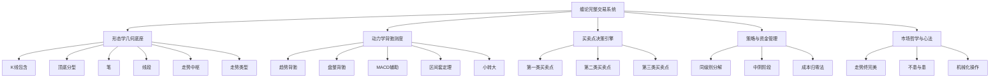

# 缠论《教你炒股票108课》LLM Wiki 知识总图谱

欢迎查阅 **缠论 108 课开源知识库**。本知识库基于缠中说禅《教你炒股票108课》原始文稿与图表，运用 LLM Wiki 知识工程技术构建而成，全面融合 **OKF (Open Knowledge Format)** 规范，无缝适配 Obsidian 深度双链图谱与源码全文回溯。

---

## 🗺️ 核心知识体系五维地图

### 1. 形态学几何体系 (Morphology)
从微观 K 线到宏观走势的公理化几何构建：
- [[concepts/k-line-inclusion|K线包含关系与标准化预处理]]：相邻 K 线高低点包含关系判定与结合律合并规则。
- [[concepts/fractal-patterns|顶分型与底分型结构]]：经包含处理后的三根相邻 K 线的极值转折结构。
- [[concepts/stroke-definition|笔的定义与划分准则]]：连接顶底分型、至少包含5根有效K线的几何最小构件。
- [[concepts/line-segment|线段划分与特征序列破坏]]：由至少三笔重叠构成的更高级别结构与两类线段破坏判定。
- [[concepts/trend-pivot|走势中枢的数学定义与区间确定]]：三段连续次级别走势重叠区间 $[ZD, ZG]$。
- [[concepts/pivot-evolution|走势中枢的延续、扩展与扩张]]：中枢震荡、9段升级与中枢新生。
- [[concepts/trend-types|走势类型与走势终完美核心定理]]：上涨、下跌、盘整三大走势与“走势终完美”公理。

### 2. 动力学背驰与测度 (Dynamics)
测量走势动能衰竭与拐点定位的物理系统：
- [[concepts/trend-divergence|趋势背驰与标准背驰判定]]：包含两个以上同级别中枢的趋势离开段动能衰竭定理。
- [[concepts/consolidation-divergence|盘整背驰与转折力度分析]]：单中枢震荡中的背驰与大级别历史底部定位。
- [[concepts/macd-auxiliary-judgment|MACD指标对背驰与力度的辅助量化]]：利用红绿柱面积与黄白线双峰高度进行动能度量。
- [[concepts/nested-interval-locating|区间套定位定理与精确打击]]：跨时间周期逐级嵌套锁定分时针尖买卖点。
- [[concepts/small-scale-reversal|小级别背驰引发大级别转折（小转大）]]：突发合力爆发打破大级别背驰预期的应对之道。

### 3. 买卖点决策与完备性 (Buy & Sell Points)
资本市场唯一盈利入口的数学完备闭环：
- [[concepts/three-classes-of-buy-sell-points|三类买卖点完备性定理与分类]]：一买（趋势背驰）、二买（回调确认）、三买（中枢破坏）的严格数学定义。

### 4. 交易策略与资金风控 (Strategy & Risk Control)
- [[concepts/same-scale-decomposition|走势类型连接的同级别分解]]：规整化固定周期级别的首尾相连分析。
- [[concepts/intermediate-yin-phase|中阴阶段演化与走势多义性]]：中枢震荡方向未明朗前的量子叠加期应对。
- [[concepts/capital-and-position-management|资金管理与仓位风控体系]]：成本归零法、三级别金字塔建仓与无条件止损。
- [[concepts/chanlun-trading-system-framework|缠论完整交易系统架构与实战总纲]]：五维立体闭环交易系统总览。

### 5. 市场哲学与心性修养 (Philosophy & Mindset)
- [[concepts/market-philosophy-invariant|缠论哲学：不患与患、市场与人生]]：以微分几何与佛儒哲学为底座的市场本体论。
- [[concepts/mechanical-trading-and-rhythm|机械化操作与市场当下节奏]]：如钢铁般执行纪律、彻底剥离生物情绪代码。

### 6. 核心实体 (Entities)
- [[entities/chanzhongshuozhan|缠中说禅]]：缠论原创作者、新浪博客传奇博主。
- [[entities/macd-indicator|MACD 技术指标]]：平滑异同移动平均线与动量积分。
- [[entities/moving-average-system|缠中说禅均线系统与吻论]]：飞吻、唇吻、湿吻与男上位/女上位。

---

## 📚 108 课全集精要导航目录

- [[summaries/summary-lesson-001.md|第 001 课：教你炒股票1：不会赢钱的经济人，只是废人！ ]]
- [[summaries/summary-lesson-002.md|第 002 课：教你炒股票2：没有庄家，有的只是赢家和输家！]]
- [[summaries/summary-lesson-003.md|第 003 课：教你炒股票3：你的喜好，你的死亡陷阱！ ]]
- [[summaries/summary-lesson-004.md|第 004 课：教你炒股票4：什么是理性？今早买N中工就是理性！]]
- [[summaries/summary-lesson-005.md|第 005 课：教你炒股票5：市场无须分析，只要看和干！]]
- [[summaries/summary-lesson-006.md|第 006 课：教你炒股票6：本ID如何在五粮液、包钢权证上提款的！]]
- [[summaries/summary-lesson-007.md|第 007 课：教你炒股票7：给赚了指数亏了钱的一些忠告 ]]
- [[summaries/summary-lesson-008.md|第 008 课：教你炒股票8：投资如选面首，G点为中心，拒绝ED男！]]
- [[summaries/summary-lesson-009.md|第 009 课：教你炒股票9：甄别“早泄”男的数学原则！ ]]
- [[summaries/summary-lesson-010.md|第 010 课：教你炒股票10：2005年6月，本ID为何时隔四年后重看股票]]
- [[summaries/summary-lesson-011.md|第 011 课：教你炒股票11：不会吻，无以高潮！]]
- [[summaries/summary-lesson-012.md|第 012 课：教你炒股票12：一吻何能消魂？]]
- [[summaries/summary-lesson-013.md|第 013 课：教你炒股票13：不带套的操作不是好操作！]]
- [[summaries/summary-lesson-014.md|第 014 课：教你炒股票14：喝茅台的高潮程序！]]
- [[summaries/summary-lesson-015.md|第 015 课：教你炒股票15：没有趋势，没有背驰。]]
- [[summaries/summary-lesson-016.md|第 016 课：教你炒股票16：中小资金的高效买卖法。]]
- [[summaries/summary-lesson-017.md|第 017 课：教你炒股票17：走势终完美]]
- [[summaries/summary-lesson-018.md|第 018 课：教你炒股票18：不被面首的雏男是不完美的。]]
- [[summaries/summary-lesson-019.md|第 019 课：教你炒股票19：学习缠中说禅技术分析理论的关键]]
- [[summaries/summary-lesson-020.md|第 020 课：教你炒股票20：缠中说禅走势中枢级别扩张及第三类买卖点]]
- [[summaries/summary-lesson-021.md|第 021 课：教你炒股票21：缠中说禅买卖点分析的完备性]]
- [[summaries/summary-lesson-022.md|第 022 课：教你炒股票22：将8亿的大米装到5个庄家的肚里。]]
- [[summaries/summary-lesson-023.md|第 023 课：教你炒股票23：市场与人生]]
- [[summaries/summary-lesson-024.md|第 024 课：教你炒股票24：MACD对背弛的辅助判断]]
- [[summaries/summary-lesson-025.md|第 025 课：教你炒股票25：吻，MACD、背弛、中枢]]
- [[summaries/summary-lesson-026.md|第 026 课：教你炒股票26：市场风险如何回避]]
- [[summaries/summary-lesson-027.md|第 027 课：教你炒股票27： 盘整背驰与历史性底部]]
- [[summaries/summary-lesson-028.md|第 028 课：教你炒股票28：下一目标：摧毁基金]]
- [[summaries/summary-lesson-029.md|第 029 课：教你炒股票29：转折的力度与级别]]
- [[summaries/summary-lesson-030.md|第 030 课：教你炒股票30：缠中说禅理论的绝对性]]
- [[summaries/summary-lesson-031.md|第 031 课：教你炒股票31：资金管理的最稳固基础]]
- [[summaries/summary-lesson-032.md|第 032 课：教你炒股票32：走势的当下与投资者的思维方式]]
- [[summaries/summary-lesson-033.md|第 033 课：教你炒股票33：走势的多义性]]
- [[summaries/summary-lesson-034.md|第 034 课：教你炒股票34：宁当面首，莫成怨男]]
- [[summaries/summary-lesson-035.md|第 035 课：教你炒股票35：给基础差的同学补补课]]
- [[summaries/summary-lesson-036.md|第 036 课：教你炒股票36：走势类型连接结合性的简单运用]]
- [[summaries/summary-lesson-037.md|第 037 课：教你炒股票37：背驰的再分辨]]
- [[summaries/summary-lesson-038.md|第 038 课：教你炒股票38：走势类型连接的同级别分解]]
- [[summaries/summary-lesson-039.md|第 039 课：教你炒股票39：同级别分解再研究]]
- [[summaries/summary-lesson-040.md|第 040 课：教你炒股票40：同级别分解的多重赋格]]
- [[summaries/summary-lesson-041.md|第 041 课：教你炒股票41：没有节奏，只有死]]
- [[summaries/summary-lesson-042.md|第 042 课：教你炒股票42：有些人是不适合参与市场的]]
- [[summaries/summary-lesson-043.md|第 043 课：教你炒股票43：有关背驰的补习课]]
- [[summaries/summary-lesson-044.md|第 044 课：教你炒股票44：小级别背驰引发大级别转折]]
- [[summaries/summary-lesson-045.md|第 045 课：教你炒股票45：持股与持币，两种最基本的操作。]]
- [[summaries/summary-lesson-046.md|第 046 课：教你炒股票46：每日走势的分类]]
- [[summaries/summary-lesson-047.md|第 047 课：教你炒股票47：一夜情行情分析]]
- [[summaries/summary-lesson-048.md|第 048 课：教你炒股票48：暴跌，牛市行情的一夜情]]
- [[summaries/summary-lesson-049.md|第 049 课：教你炒股票49：利润率最大的操作模式]]
- [[summaries/summary-lesson-050.md|第 050 课：教你炒股票50：操作中的一些细节问题]]
- [[summaries/summary-lesson-051.md|第 051 课：教你炒股票51：短线股评荐股者的传销把戏]]
- [[summaries/summary-lesson-052.md|第 052 课：教你炒股票52：炒股票就是真正的学佛]]
- [[summaries/summary-lesson-053.md|第 053 课：教你炒股票53：三类买卖点的再分辨]]
- [[summaries/summary-lesson-054.md|第 054 课：教你炒股票54：一个具体走势的分析]]
- [[summaries/summary-lesson-055.md|第 055 课：教你炒股票55：买之前戏，卖之高潮]]
- [[summaries/summary-lesson-056.md|第 056 课：教你炒股票56：530印花税当日行情图解]]
- [[summaries/summary-lesson-057.md|第 057 课：教你炒股票57：当下图解分析再示范]]
- [[summaries/summary-lesson-058.md|第 058 课：教你炒股票58：图解分析示范三]]
- [[summaries/summary-lesson-059.md|第 059 课：教你炒股票59：图解分析示范四]]
- [[summaries/summary-lesson-060.md|第 060 课：教你炒股票60：图解分析示范五]]
- [[summaries/summary-lesson-061.md|第 061 课：教你炒股票61：区间套定位标准图解（分析示范六）]]
- [[summaries/summary-lesson-062.md|第 062 课：教你炒股票62：分型、笔与线段]]
- [[summaries/summary-lesson-063.md|第 063 课：教你炒股票63：替各位理理基本概念]]
- [[summaries/summary-lesson-064.md|第 064 课：教你炒股票64：去机场路上给各位补课]]
- [[summaries/summary-lesson-065.md|第 065 课：教你炒股票65：再说说分型、笔、线段]]
- [[summaries/summary-lesson-066.md|第 066 课：教你炒股票66：主力资金的食物链]]
- [[summaries/summary-lesson-067.md|第 067 课：教你炒股票67：线段的划分标准]]
- [[summaries/summary-lesson-068.md|第 068 课：教你炒股票68：走势预测的精确意义]]
- [[summaries/summary-lesson-069.md|第 069 课：教你炒股票69：月线分段与上海大走势分析、预判]]
- [[summaries/summary-lesson-070.md|第 070 课：教你炒股票70：一个教科书式走势的示范分析]]
- [[summaries/summary-lesson-071.md|第 071 课：教你炒股票71：线段划分标准的再分辨]]
- [[summaries/summary-lesson-072.md|第 072 课：教你炒股票72：本ID已有课程的再梳理]]
- [[summaries/summary-lesson-073.md|第 073 课：教你炒股票73：市场获利机会的绝对分类]]
- [[summaries/summary-lesson-074.md|第 074 课：教你炒股票74：如何躲避政策性风险]]
- [[summaries/summary-lesson-075.md|第 075 课：教你炒股票75：逗庄家玩的一些杂史1]]
- [[summaries/summary-lesson-076.md|第 076 课：教你炒股票76：逗庄家玩的一些杂史2]]
- [[summaries/summary-lesson-077.md|第 077 课：教你炒股票77：一些概念的再分辨]]
- [[summaries/summary-lesson-078.md|第 078 课：教你炒股票78：继续说线段的划分]]
- [[summaries/summary-lesson-079.md|第 079 课：教你炒股票79：分型的辅助操作与一些问题的再解答]]
- [[summaries/summary-lesson-080.md|第 080 课：教你炒股票80：市场没有同情、不信眼泪]]
- [[summaries/summary-lesson-081.md|第 081 课：教你炒股票81：图例、更正及分型、走势类型的哲学本质]]
- [[summaries/summary-lesson-082.md|第 082 课：教你炒股票82：分型结构的心理因素]]
- [[summaries/summary-lesson-083.md|第 083 课：教你炒股票83：笔-线段与线段-最小中枢结构的不同心理意义1]]
- [[summaries/summary-lesson-084.md|第 084 课：教你炒股票84：本ID理论一些必须注意的问题]]
- [[summaries/summary-lesson-085.md|第 085 课：教你炒股票85：逗庄家玩的一些杂史3]]
- [[summaries/summary-lesson-086.md|第 086 课：教你炒股票86：走势分析中必须杜绝一根筋思维]]
- [[summaries/summary-lesson-087.md|第 087 课：教你炒股票87：逗庄家玩的一些杂史4]]
- [[summaries/summary-lesson-088.md|第 088 课：教你炒股票88：图形生长的一个具体案例]]
- [[summaries/summary-lesson-089.md|第 089 课：教你炒股票89：中阴阶段的具体分析]]
- [[summaries/summary-lesson-090.md|第 090 课：教你炒股票90：中阴阶段结束时间的辅助判断]]
- [[summaries/summary-lesson-091.md|第 091 课：教你炒股票91：走势结构的两重表里关系1]]
- [[summaries/summary-lesson-092.md|第 092 课：教你炒股票92：中枢震荡的监视器]]
- [[summaries/summary-lesson-093.md|第 093 课：教你炒股票93：走势结构的两重表里关系2]]
- [[summaries/summary-lesson-094.md|第 094 课：教你炒股票94：当机立断]]
- [[summaries/summary-lesson-095.md|第 095 课：教你炒股票95：修炼自己]]
- [[summaries/summary-lesson-096.md|第 096 课：教你炒股票96：无处不在的赌徒心理]]
- [[summaries/summary-lesson-097.md|第 097 课：教你炒股票97：中医、兵法、诗歌、操作1]]
- [[summaries/summary-lesson-098.md|第 098 课：教你炒股票98：中医、兵法、诗歌、操作2]]
- [[summaries/summary-lesson-099.md|第 099 课：教你炒股票99：走势结构的两重表里关系3]]
- [[summaries/summary-lesson-100.md|第 100 课：教你炒股票100：中医、兵法、诗歌、操作3]]
- [[summaries/summary-lesson-101.md|第 101 课：教你炒股票101：答疑1 ]]
- [[summaries/summary-lesson-102.md|第 102 课：教你炒股票102：再说走势必完美]]
- [[summaries/summary-lesson-103.md|第 103 课：教你炒股票103：学屠龙术前先学好防狼术]]
- [[summaries/summary-lesson-104.md|第 104 课：教你炒股票104：几何结构与能量动力结构1]]
- [[summaries/summary-lesson-105.md|第 105 课：教你炒股票105：远离聪明、机械操作]]
- [[summaries/summary-lesson-106.md|第 106 课：教你炒股票106：均线、轮动与缠中说禅板块强弱指标]]
- [[summaries/summary-lesson-107.md|第 107 课：教你炒股票107：如何操作短线反弹]]
- [[summaries/summary-lesson-108.md|第 108 课：教你炒股票108：何谓底部？从月线看中期走势演化]]

---

## 📜 知识库维护日志
记录知识库的所有演进与编译历史，详见 [[log|OpenWiki 操作历史日志]]。
